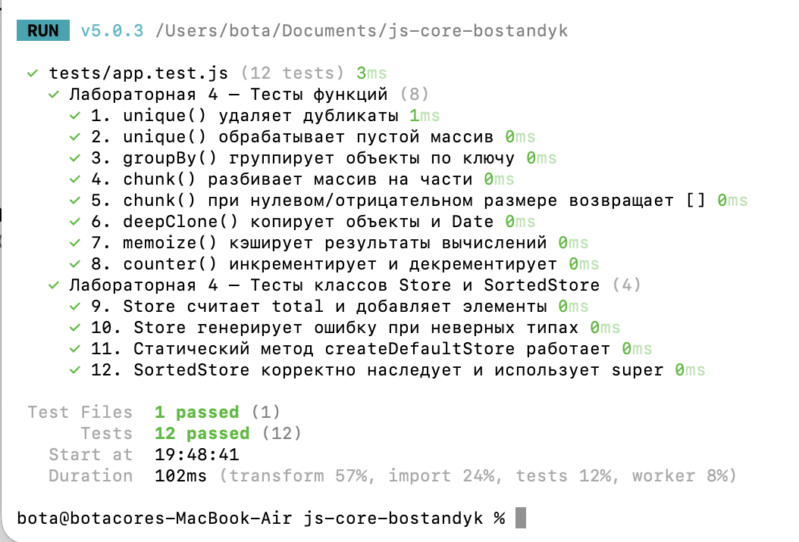

# Lab 4: JS Core

**Author:** Akbota Bostandyk (IT1-2305)  

---

## 1. How to Run Tests

To install dependencies and run the Vitest test suite, use the following commands:

npm install
npm test

Note: Run "npm run test:watch" if you want Vitest to automatically re-run tests on file changes.

---

## 2. Implemented Features

### Core Functions

* **unique(arr)**: Removes duplicate values from an array. It returns [] for non-array inputs.
* **groupBy(arr, keyFn)**: Groups items by a dynamically calculated key. It returns {} for invalid inputs.
* **chunk(arr, size)**: Divides an array into smaller chunks of a specific size. It returns [] if the size is <= 0.
* **deepClone(obj)**: Creates a deep copy of objects, arrays, and Dates, safely cloning nested references.
* **memoize(fn)**: Caches function execution results using closures, returning cached results on repeated arguments.
* **counter()**: A factory function that creates a private counter and encapsulates state securely.

### Classes

* **Store**: Manages items containing a name, price, and quantity. It features a private field #items, methods for add(), remove(), find(), a total getter, and a static method createDefaultStore().
* **SortedStore**: Extends Store and overrides store methods using super.

---

## 3. Closures in My Code

A closure occurs when a function retains access to variables from its lexical scope even after the outer function has finished executing.

In **counter()**, the variable `count` is declared inside the function body, while the returned methods (`inc`, `dec`, `value`) are defined in the same scope. This allows these methods to maintain access to `count` while keeping it completely encapsulated and inaccessible from direct external modification. Each call to `counter()` creates a distinct lexical environment, ensuring state isolation.

Similarly, **memoize(fn)** utilizes a closure to preserve an internal `cache` Map across multiple invocations, allowing the inner returned function to look up saved computations before delegating to `fn`.

---

## 4. Test Results

---

## 5. Tools Used

* **MDN Web Docs:** Referenced for JavaScript closures, ES6 classes, private class fields, and array methods.
* **Vitest Documentation:** Used for test suite syntax (describe, it, expect).
* **Gemini AI** 
